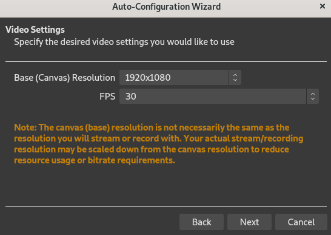
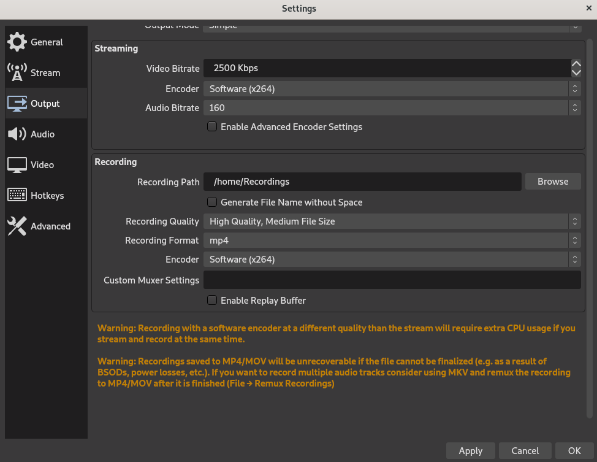

# How to record material for virtual presentaions

## Using OBS Studio to Record Video

1. Download the installer for your system and install OBS Studio: [OBS Installation Instructions](https://obsproject.com/wiki/install-instructions)
2. Open OBS Studio and run through the _AutoConfig Wizard_
    1. Select `Optimize for recording` as the focus is on recording our screen.
    2. Select `1920x1080` for the Base Resolution, and `30` for the FPS.
    .
    3. Once it is done testing, click on `Apply Settings`.
3. Next, we will be configuring the OSB settings. Start by click on `Settings`
    1. Click on `Output`
        - Select an output path.
        - Select `mp4` as the Recording Format
        - Select `x264` for the Encoder
        - The bitrate is a fine balance between video size and quality. Generally the default of 2500 Kbps is enough for most demos. If your recording requires a higher resolution/framerate the  Youtube's [Recommended upload encoding settings](https://support.google.com/youtube/answer/1722171) provide a good guide.
        
    2. Click on `Audio`
        - Select your microphone under the `Mic/Auxiliary Audio` setting
        - It's generally preferred to use a mic that is _not_ your laptop's inbuilt microphone. Though convenient, the audio quality will be worse than using a USB microphone.
        - While OBS allows you to record both audio and your screen at the same time, we'd recommend recording your screen and vocalizing your demo separately, and overlaying them. This is much simpler than trying to do both at the same time.
    3. Click on `Video`
        - Set the `Base resolution` to 1920x1080
        - Set the `Output resolution` to 1920x1080
        - Set the `FPS` to 30
    4. Note: You can also setup hotkeys via the `Hotkeys` tab to start/stop recordings if you find using the keyboard simpler.
4. Scene and Source Setup
    1. Add the `Screen Capture` Source by clicking the + in the Sources box
    2. Pick the screen you are looking to capture (if you have additional monitors)
        - Right click on the live screen capture with OBS and choose Transform -> Center. Then, right click on the capture and choose Transform -> Fit to Screen
        - Note: Wayland users may run into an issue with OBS showing a black screen. Switching to Xorg is a quick fix for the issue.
    3. Add your webcam to the bottom corner if you want.
        - To do so, you can just click on the `+` and adding a video capture device. Resize as desired.
    4. OBS Studio makes it easy to switch between scenes. If you would like to record a different ‘thing’ for your recording you might want to add scenes and flip through them while recording live.

## Using Audacity to Record Audio

Recording audio separately from when you make your recording allows you to flub all you want and edit audio as needed without being
forced to re-do steps in your presentation. It also lets you focus solely on speaking without paying attention to what you are clicking.

1. Download and install [Audacity](https://www.audacityteam.org/download/).
2. Set Audacity to record stereo. In case you have only a mono mic, recording in stereo will just put the same audio on both channels.
3. Once you are done recording, click on `File -> Export -> Export as MP3`

## Using Blender to Combine Video and Audio

1. Download Blender from the official [Blender website](https://www.blender.org/download/).
    1. This is important as your distribution’s Blender may be missing certain codec support and the like.
2. Open Blender and click on `Video Editing` under `New File`.
3. Verify that the frame rates on all your videos ar the same (30)
    1. `mediainfo` provides an easy way to check the framerate.
4. The following two playlists provide a good overview of Blender
    1. [Waylight Creations Blender 2.8 Video Editing](https://www.youtube.com/playlist?list=PLlXsqAWo0V6IiiThMKxaezET2sdO7grjQ)
    2. [Mikeycal Meyers Blender Video Editing 2.7X Series](https://www.youtube.com/playlist?list=PLjyuVPBuorqIhlqZtoIvnAVQ3x18sNev4)
